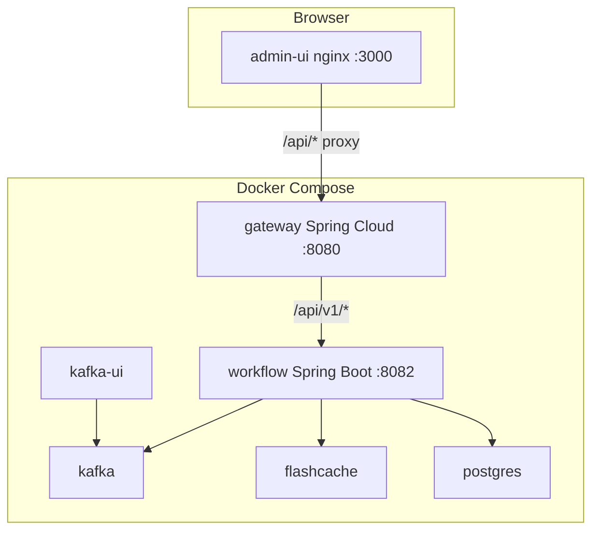

# PulseFlow local architecture

This document maps the [PRD](PRD.md) to what runs in this repository for local development.

## Topology

Kafka uses two listeners so that:

- Processes on the host (Spring Boot) connect to `localhost:9092`.
- Containers on the Docker network (Kafka UI, topic bootstrap, workflow) connect to `kafka:29092`.

## Spring Boot services

### Workflow (`pulseflow/backend`)

- REST API for campaigns and jobs (including list endpoints used by the dashboard).
- Kafka producers and consumers for the core notification pipeline.
- **FlashCache** (see [`flashcache/README.md`](../../flashcache/README.md)) for per-job locks and idempotency markers via the JVM SDK (`com.flashcache:sdk`).
- PostgreSQL for durable job and campaign state (via Flyway).

### Gateway (`pulseflow/gateway`)

- Spring Cloud Gateway on port **8080** by default.
- Routes `/api/v1/**` to the workflow service (`pulseflow.workflow.base-url`, overridden in Compose as `http://workflow:8082`).
- Global CORS for local dev origins (`http://localhost:*` patterns).
- Optional stub auth when `pulseflow.gateway.security.enabled=true` (requires `X-Api-Key`).

### Admin UI (`pulseflow/admin-ui`)

- Vite + React + TypeScript + Tailwind for local development.
- Production image uses nginx to serve static assets and reverse-proxy `/api/` to the gateway container.

## Topics

| Topic | Producer | Consumer |
| --- | --- | --- |
| `campaign.created` | REST campaign create | none in this sample |
| `notification.send` | REST job create, retry fan-in | workflow send group |
| `notification.retry` | send consumer on failure | workflow retry group |
| `notification.dlq` | send consumer after max retries | none |
| `notification.completed` | send consumer on success | none |

## Retry and DLQ behaviour

`pulseflow.max-retries` defaults to `3`. Each failure increments `jobs.retry_count`. When the count reaches the limit, the job is marked `FAILED` and a payload is written to `notification.dlq`.

The retry consumer applies bounded exponential backoff before republishing to `notification.send`.

## Observability

Micrometer Prometheus registry is enabled on the workflow service. Scrape `GET http://localhost:8082/actuator/prometheus` when the workflow port is published, or add a Prometheus sidecar in Compose later.

The gateway exposes `GET /actuator/health` on port 8080.
